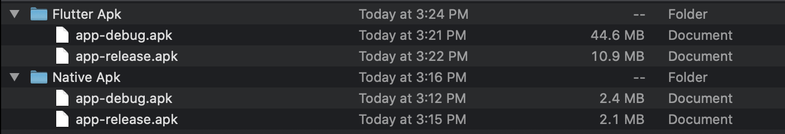

# Flutter VS Native
This repo will showing how different size of APK between Flutter and Native Android with simple application of Hello World.

### Screenshot Application

<pre>
     
</pre>

### Size of APK
- Flutter : Debug = 44.6 MB and Release = 10.9 MB
- Native  : Debug = 2.4 MB and Release = 2.1 MB

*Note : MB is Megabyte

*Note : In this sample apps, I don't use any image / asset between Flutter and Android. I just build some UI in XML file for Android, and build some Widget for UI using StatelessWidget in Flutter.
